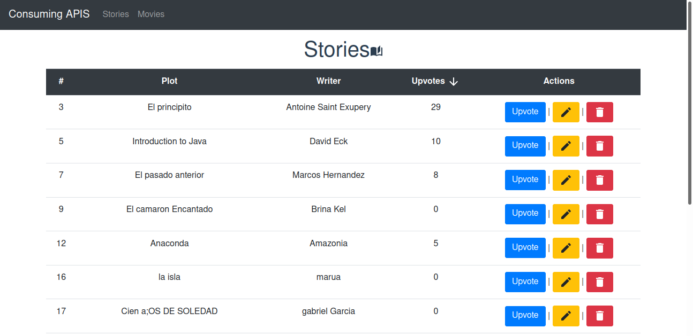

# demo-api

This is a demo for using an api from textBook "The Majesty of vue" in chapter 8.
The api have two entities stories and movies, there is a UI for make a crud
on both entities.
This proyect use this
"dependencies": {
    "axios": "^0.26.0",
    "core-js": "^3.6.5",
    "lodash": "^4.17.21",
    "vue": "^3.0.0",
    "vue-axios": "^3.4.1",
    "vue-material-design-icons": "^5.0.0",
    "vue-router": "^4.0.12"
  }, 


## Project setup
```
npm install
```

### Compiles and hot-reloads for development
```
npm run serve
```

### Compiles and minifies for production
```
npm run build
```

### Lints and fixes files
```
npm run lint
```

### A view of the app


### Customize configuration
See [Configuration Reference](https://cli.vuejs.org/config/).
